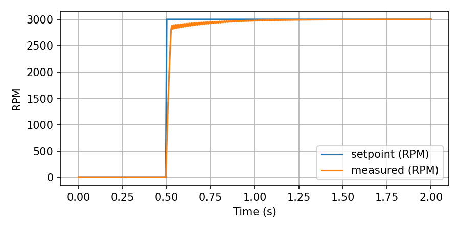

# pid-motor-control-esp32

Minimal embedded closed-loop motor speed PID demo for **ESP32 (PlatformIO)**.
Produces CSV logs over serial and a simple step-response demo. Includes host-mode PID unit tests and a Python simulator.

---

## Running the simulation (no hardware)

### 1. Ensure Python 3 is installed.
### 2. Install dependencies:
```bash
pip install matplotlib numpy
```
### 3. Run the simulator with default PID:
```bash
python3 sim/sim.py
```
Outputs:

sim_output.csv → CSV data

sim_plot.png → setpoint vs measured RPM




### 4. (Optional) Customize PID:
```bash
python3 sim/sim.py --kp 0.005 --ki 0.03 --kd 0.0 --out my_log.csv --plot my_plot.png
```
## Flashing and running on ESP32 from Windows (if hardware available)

### 1. Build and upload:
```bash
pio run -e esp32dev -t upload
```

### 2. Open serial monitor:
```bash
pio device monitor -e esp32dev -b 115200
```

Toggle step change with button (pin 0) or type s in monitor.


---

## Flashing & Running ESP32 from WSL2

### 1. Prepare Windows host (once)

Because ESP32 USB drivers only work on the Windows side, we need to expose the COM port into WSL2.

1. Plug in the ESP32 dev board (e.g. ESP32-WROOM).
2. In **Windows Device Manager**, check under **Ports (COM & LPT)** — note the port (e.g. `COM3` or `COM5`).
3. Install ESP32 USB drivers if the device is not recognized.

---

### 2. Expose COM port to WSL2

In an **Administrator PowerShell** window:

```powershell
wsl --shutdown
```

Then add port mapping (replace `COM3` with your actual port):

```powershell
usbipd wsl list
usbipd wsl attach --busid <busid> --distribution <your_distro_name>
```

* The `busid` comes from `usbipd wsl list` output.
* Example:

```powershell
usbipd wsl list
BUSID  VID:PID    DEVICE                               STATE
1-4    10C4:EA60  Silicon Labs CP210x USB to UART Bridge Not attached

usbipd wsl attach --busid 1-4 --distribution Ubuntu-22.04
```

Now the ESP32 USB serial device is visible inside WSL2 as `/dev/ttyUSB0`.

---

### 3. Inside WSL2 — install PlatformIO (once)

If not already installed:

```bash
# In your WSL2 shell
pip install -U platformio
```

Or use the VSCode PlatformIO extension (works seamlessly with WSL).

---

### 4. Build the firmware

From the repo root:

```bash
pio run -e esp32dev
```

You should see `SUCCESS` if the build completes.

---

### 5. Flash firmware to ESP32

Still inside WSL2:

```bash
pio run -e esp32dev -t upload --upload-port /dev/ttyUSB0
```

⚠️ Replace `/dev/ttyUSB0` with your actual device (check with `ls /dev/ttyUSB*`).

If you see permission denied:

```bash
sudo usermod -aG dialout $USER
# then log out and back in
```

---

### 6. Open the serial monitor

After flashing:

```bash
pio device monitor -e esp32dev -b 115200 --port /dev/ttyUSB0
```

You should see output like:

```
PID motor-speed demo started
Loop Hz: 200
time_ms,setpoint_rpm,measured_rpm,duty
10,0.00,0.00,0.0000
15,0.00,0.00,0.0000
```

---

### 7. Trigger a step change

* **Option A (button):** Press the ESP32 `BOOT` button (wired to GPIO0 by default).
* **Option B (serial):** In the monitor, type `s` (lowercase) and press Enter.

You’ll see `setpoint_rpm` jump (e.g., from 0 to 3000), and `measured_rpm` should rise in response.

---

### 8. Save log for plotting

Capture the CSV to a file:

```bash
pio device monitor -e esp32dev -b 115200 --port /dev/ttyUSB0 | tee log.csv
```

Press `Ctrl+C` after a few seconds of data.

---

### 9. Plot in Python 

```python
import pandas as pd
import matplotlib.pyplot as plt

df = pd.read_csv("log.csv")
t = df['time_ms']/1000
plt.plot(t, df['setpoint_rpm'], label="setpoint")
plt.plot(t, df['measured_rpm'], label="measured")
plt.xlabel("Time (s)")
plt.ylabel("RPM")
plt.legend()
plt.show()
```


